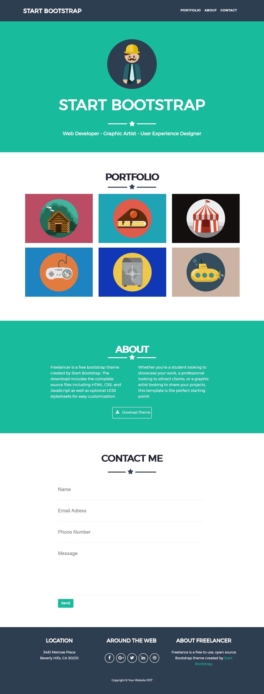

# Freelancer

* **Tema:** _Maquetado web con HTML & CSS_

## Objetivo
Realizar una replica de la pagina:
<https://blackrockdigital.github.io/startbootstrap-freelancer/>

## Desarrollo

* En este trabajo ulizamos un header, 4 secciones y un footer.
* Esta web utiliza 2 tipografías: `Montserrat` y `Lato`.
* Dentro del trabajo utilizamos div, listas, etc.
* Para el header utilizamosuna lista desordenada dentro de un nav.
* Dentro de la pagina tenemos 4 secciones presentation, porfolio, about, contact-me.
* En la sección de presentation insertamos una imagen, agregamos el título principal de la página y la estrella entre en medio de una linea gruesa esta dentro de un div.
* En porfolio contiene un subtítulo y dos div uno pata la estrella, la raya y otro para las imagenes que contiene.
* About contiene un subtitulo y dos div en el primero contiene la estrella con la linea gruesa y en el siguiente contiene dos textos, finalmente agregamos un ancor que subcontiene un icono y unas palabras.
* En contact-me contiene el formulario en la que se pide al visitante que ingrese su nombre, email, número, un mensaje y el boton de enviar cada uno de ellos dentro de un div.
* Finalmente dentro de la página tenemos un footer que contiene 4 div dentro de otro div.
* Cada parte de esta página a sido modificado con diferentes estilos en CSS para ser lo mas parecido a lo original.

## Imagen referencial de la replica

